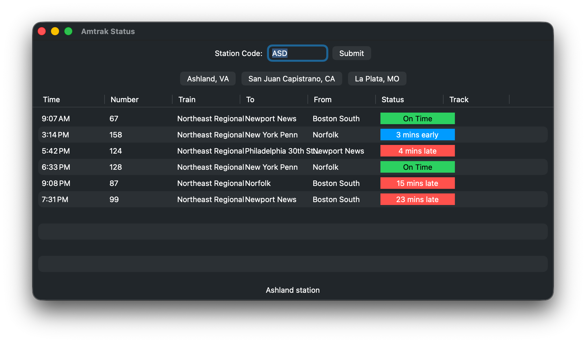

<p align="center">
    
    
</p>
          
## 🖥️ Supported Platforms

| Platform                     | Minimum Version |
| ---------------------------- | --------------- |
| macOS                        | 10.15+          |
| Windows                      | 10+             |
| Linux                        | gtk 3+          |

## 🔨 Setup

### Prerequisites

You will need Swift Bundler to properly run and bundle your app.

1. ``brew install mint``
2. ``mint install stackotter/swift-bundler@main``

### Running

```
swift-bundle run
```

### Bundling

```
swift-bundler bundle -c (release|debug)
```

## 🔍 Background

This was intended to solve a rather awkward dilemma. I turned a bunch of online Amtrak status boards made by [Dixieland Software](http://dixielandsoftware.net/Amtrak/status/StatusMaps/) into PWAs (standalone web apps) for stations that I viewed on Virtual Railfan. While it was convenient - don't get me wrong - I had to create a new web app for each and every station, and it was becoming overwhelming.

So I created simple frontend that mapped to Dixieland Software's API using Tauri. You could type in simple station code and it'd take you their status board from within the app. Simple, right? Unfortunately, I didn't know how to get it go back to change the station, my attempted UI redesigns kept failing, and I accidentally botched a migration to Tauri 2.0.

So it sat abandoned until I discovered SwiftCrossUI. Now it directly makes use of [Amtraker](https://amtraker.com/)'s API.

## ⚖️ License

I license this project under the GPL-3.0 license - see [LICENSE](LICENSE) for details.

## ⚠️ Disclaimer

_This project is not in any way affiliated with Amtrak._
